 

 

  

  
  

  

 

  

  

 

 

  

  

  

  
<picture>
  <source media="(prefers-color-scheme: dark)" srcset="https://raw.githubusercontent.com/wilbert0838n/wilbert0838n/output/github-contribution-grid-snake-dark.svg"/>
  <source media="(prefers-color-scheme: light)" srcset="https://raw.githubusercontent.com/wilbert0838n/wilbert0838n/output/github-contribution-grid-snake.svg"/>
  
</picture>

 

