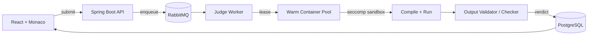

<!-- ============ HEADER ============ -->


<div align="center">

<a href="https://git.io/typing-svg">
  
</a>

<br/><br/>

<a href="https://wilbertprojects.me"></a>
<a href="https://linkedin.com/in/wilbert-nadar"></a>
<a href="mailto:rohannadar88@gmail.com"></a>

</div>

<br/>

<!-- ============ ABOUT ============ -->
<table>
<tr>
<td width="55%" valign="top">

```java
public final class Wilbert extends Engineer {

    String   location   = "Mumbai, IN";
    String   studying   = "Computer Engineering @ TSEC (2028)";
    String   role       = "Core Team @ TSEC CodeCell";

    String[] building   = { "ComputeX", "Rooted" };
    String[] obsessedBy = { "sandboxing", "schedulers",
                            "low-latency judging", "Linux internals" };

    String   now        = "Prepping for ICPC with team W Coders";
    String   funFact    = "600+ problems and still can't stop";
}
```

</td>
<td width="45%" valign="top">

**⚡ quick facts**

🧠 &nbsp;Solo-built a full online judge, sandbox to scoreboard<br/>
🏁 &nbsp;Ran an 8-week national CP league on it, **600+ participants**<br/>
🏆 &nbsp;CodeChef global rank **#297**<br/>
🎯 &nbsp;ICPC Chennai regionals, 2025 and 2026<br/>
✍️ &nbsp;Problem setter for CodeCell contests<br/>
🐳 &nbsp;Currently poking at containerd internals

</td>
</tr>
</table>

<!-- ============ FEATURED ============ -->
<h2 align="center">🚀 featured work</h2>

<table>
<tr>
<td width="50%" valign="top">

### ComputeX
*A competitive programming platform, built entirely solo.*

- Docker-sandboxed execution hardened with a custom **seccomp BPF** profile
- **Prewarmed container pools** for low-latency judging
- **RabbitMQ** queue for async submission handling
- Special-judge checkers, stress-tested problem bank
- Powered CodeCell's Weekly Challenges league

<code>Java 21</code> <code>Spring Boot 3</code> <code>React 18</code> <code>Monaco</code> <code>Docker</code> <code>PostgreSQL</code>

<a href="https://wilbertprojects.me"></a>

</td>
<td width="50%" valign="top">

### Rooted
*Container-based hosting for Indian engineering students.*

- Give every student a real Linux box without a real Linux box
- System containers via **sysbox-runc**, so users get Docker-in-container without privileged mode
- Built on the same isolation ideas that run the ComputeX judge

<code>Docker</code> <code>sysbox</code> <code>Linux</code> <code>Nginx</code>


</td>
</tr>
</table>

<details>
<summary><b>🔍 how a ComputeX submission gets judged</b></summary>
<br/>



</details>

<!-- ============ STACK ============ -->
<h2 align="center">🛠 toolbox</h2>

<div align="center">

<br/><br/>
<br/><br/>


</div>

<!-- ============ CP ============ -->
<h2 align="center">⚔️ competitive programming</h2>

<div align="center">

<a href="https://codeforces.com/profile/wilbert0838n"></a>
<a href="https://www.codechef.com/users/wilbert0838n"></a>
<a href="https://leetcode.com/u/wilbert0838n"></a>
<a href="https://atcoder.jp/users/wilbert0838n"></a>

<br/><br/>


</div>

<!-- ============ STATS ============ -->
<h2 align="center">📊 github</h2>

<div align="center">


</div>

<!-- ============ FOOTER ============ -->
<div align="center">

<br/>

<i>"Make it work, make it right, make it fast."</i>

<br/><br/>


</div>


